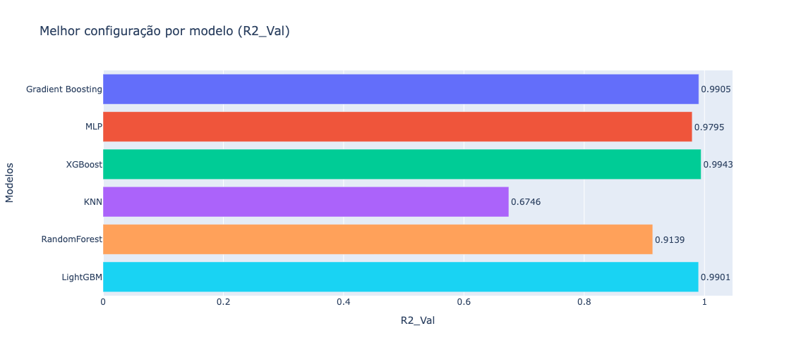
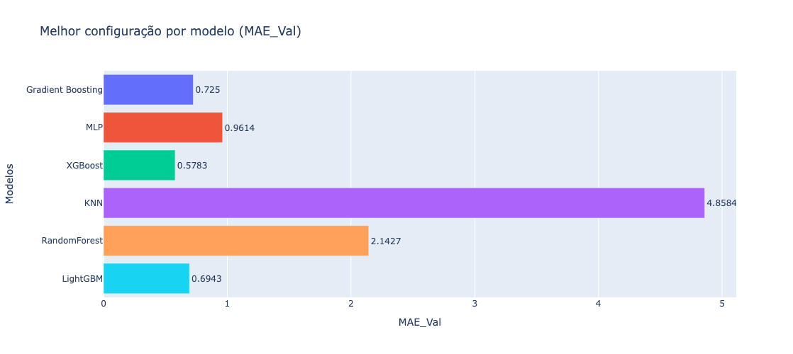
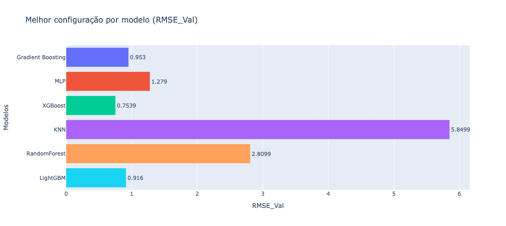
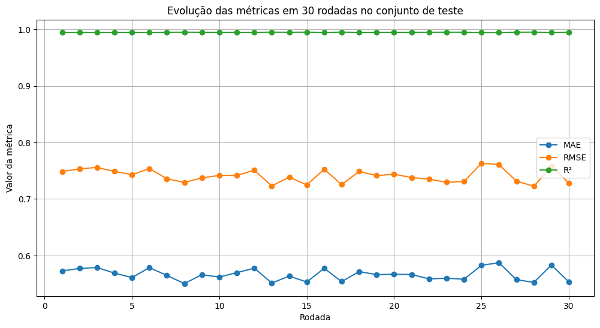
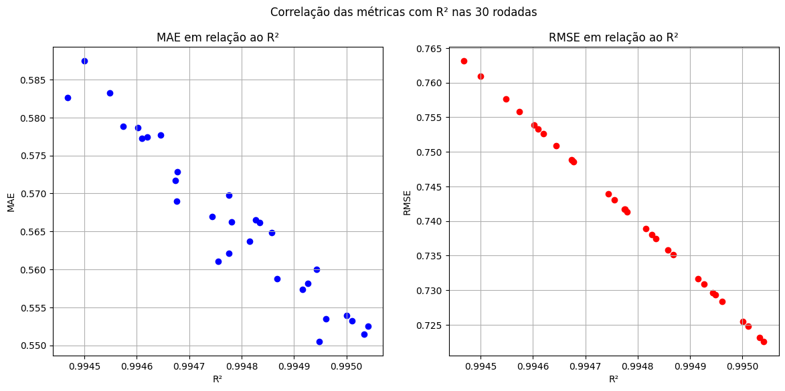

# 📊 Startup Score Prediction

O projeto visa propor uma solução para o Desafio 4 - Ciência de Dados para compor uma nova funcionalidade e alimentar o matchmaker de startups com soluçoes na plataforma Coreto da Prefeitura do Recife em parceria com a EMPREL.

Este projeto tem como objetivo prever o score de maturidade de startups com base em diferentes variáveis relacionadas a tração, rede de parceiros, governança, tecnologia e aspectos financeiros. 

O pipeline completo envolve:

1. Coleta de dados de um banco PostgreSQL.

2. Pré-processamento e modelagem de Machine Learning.

3. Construção de uma interface interativa para realizar previsões em novos dados.

## 🏗 Estrutura do Projeto

``` 
├── .streamlit/                # Configuração da interface Streamlit
├── data/
│   ├── docker/                # Setup do Postgres em container
│   │   ├── init/              # Scripts SQL para criar DB e tabelas
│   │   └── docker-compose.yml
│   ├── models_results/        # Resultados de modelos em JSON
│   ├── processed/             # Dados processados (train/test/val)
│   └── raw/                   # Dados originais extraídos do Postgres
├── notebooks/                 # Jupyter Notebooks usados no fluxo
│   ├── eda.ipynb              # Análise exploratória de dados
│   ├── preprocessing.ipynb    # Pré-processamento
│   ├── modeling.ipynb         # Modelagem e avaliação de modelos
│   ├── best_model.ipynb       # Rodadas finais do melhor modelo (XGBoost)
│   ├── models_results.ipynb   # Comparação de métricas entre modelos
│   └── modelo_startup.pkl     # Pipeline treinado salvo (pré-process + modelo)
├── main.py                    # Script principal para rodar no Streamlit
├── .env                       # Variáveis de ambiente
└── README.md                  # Documentação
```

## 🗄️ Coleta de Dados

Os dados foram armazenados em um banco PostgreSQL.

Scripts SQL para criação do banco e carga inicial estão em `data/docker/init/` .

A extração foi feita em formato CSV, armazenados em `data/raw/` .

## 🤖 Modelagem

1. Split em treino (65%), validação(25%) e teste(10%).

2. Pré-processamento

    a. Variáveis categóricas → OneHotEncoder / OrdinalEncoder.

    b. Variáveis numéricas → StandardScaler.

3. Validação Cruzada de 5 folds + Grid Search

4. Avaliação de Métricas

## Modelos testados:

- Regressão Linear

- KNN

- Random Forest

- MLP (rede neural simples)

- Gradient Boosting

- LightGBM

- XGBoost ✅


## Métricas avaliadas:

- **R² (Coeficiente de Determinação)**  

$$
R^2 = 1 - \frac{\sum_{i=1}^{n}(y_i - \hat{y}_i)^2}{\sum_{i=1}^{n}(y_i - \bar{y})^2}
$$


- **MAE (Erro Absoluto Médio)**  

$$
MAE = \frac{1}{n} \sum_{i=1}^{n} \left| y_i - \hat{y}_i \right|
$$


- **RMSE (Raiz do Erro Quadrático Médio)**  

$$
RMSE = \sqrt{\frac{1}{n} \sum_{i=1}^{n} (y_i - \hat{y}_i)^2}
$$


## Melhor modelo:

XGBoost com hiperparâmetros ajustados via GridSearchCV.





Configuração escolhida :

```
{
  "colsample_bytree": 1.0,
  "learning_rate": 0.1,
  "max_depth": 3,
  "n_estimators": 300,
  "subsample": 0.8
}
```

## Validação

O modelo foi rodado 30 vezes na base de teste, a fim de visualizar o comportamento médio das métricas.



O gráfico acima ilustra as variáveis mais relevantes para o modelo XGBoost, destacando as que mais impactam na previsão do score de maturidade das startups.

___
| Métrica | Média   | Desvio Padrão |
|---------|---------|---------------|
| MAE     | 0.5664  | 0.0105        |
| RMSE    | 0.7412  | 0.0117        |
| R²      | 0.9948  | 0.0002        |
___
E também avaliamos a evolução do erro (MAE, RMSE) em relação ao R², que foi a nossa métrica de decisão.




