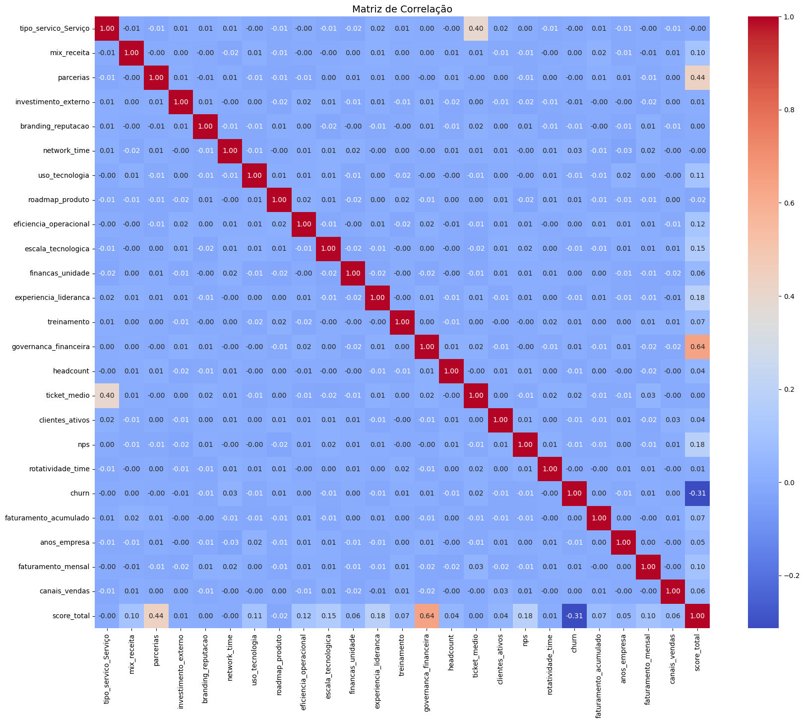
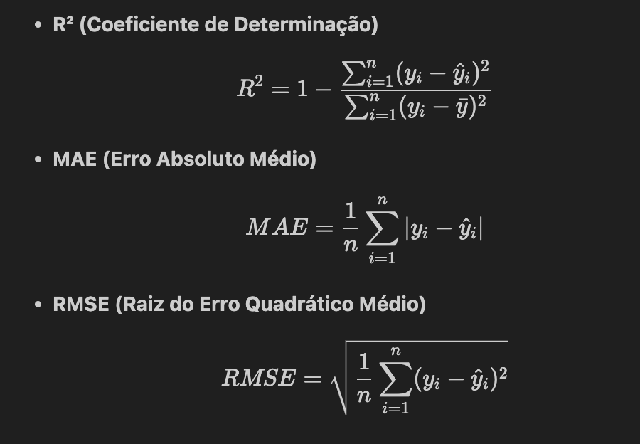
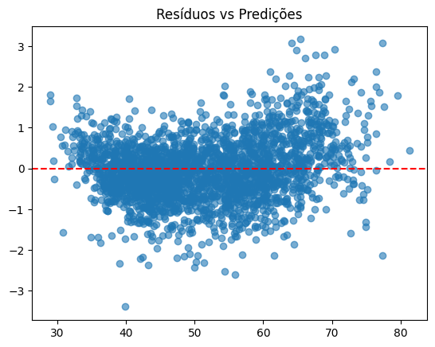
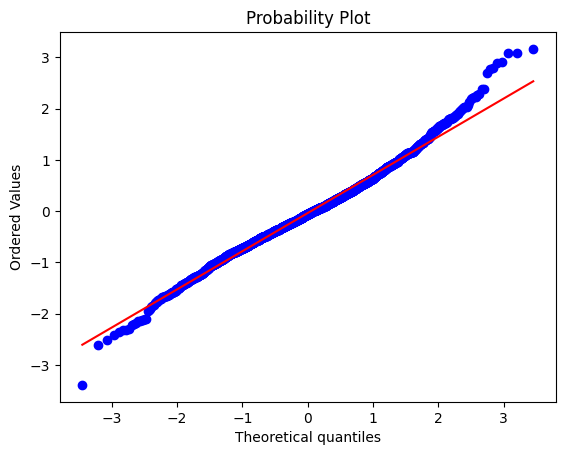

# 📊 Startup Score Prediction

https://emprel-machinelearning.onrender.com/

O projeto visa propor uma solução para o Desafio 4 - Ciência de Dados para compor uma nova funcionalidade e alimentar o matchmaker de startups com soluçoes na plataforma Coreto da Prefeitura do Recife em parceria com a EMPREL.

Este projeto tem como objetivo prever o score de maturidade de startups com base em diferentes variáveis relacionadas a tração, rede de parceiros, governança, tecnologia e aspectos financeiros. 

O pipeline completo envolve:

1. Coleta de dados de um banco PostgreSQL.

2. Pré-processamento e modelagem de Machine Learning.

3. Construção de uma interface interativa para realizar previsões em novos dados.

## 🏗 Estrutura do Projeto

``` 
├── .streamlit/                # Configuração da interface Streamlit
├── data/
│   ├── docker/                # Setup do Postgres em container
│   │   ├── init/              # Scripts SQL para criar DB e tabelas
│   │   └── docker-compose.yml
│   ├── models_results/        # Resultados de modelos em JSON
│   ├── processed/             # Dados processados (train/test/val)
│   └── raw/                   # Dados originais extraídos do Postgres
├── notebooks/                 # Jupyter Notebooks usados no fluxo
│   ├── eda.ipynb              # Análise exploratória de dados
│   ├── preprocessing.ipynb    # Pré-processamento
│   ├── modeling.ipynb         # Modelagem e avaliação de modelos
│   ├── best_model.ipynb       # Rodadas finais do melhor modelo (XGBoost)
│   ├── models_results.ipynb   # Comparação de métricas entre modelos
│   └── modelo_startup.pkl     # Pipeline treinado salvo (pré-process + modelo)
├── main.py                    # Script principal para rodar no Streamlit
├── .env                       # Variáveis de ambiente
└── README.md                  # Documentação
```

## 🗄️ Coleta de Dados

Os dados foram gerados artificialmente com base em pesquisas da área de atuação do desafio e não envolve o cenário real, tendo como objetivo principal demonstrar a técnica e o processo utilizado para avaliar e criar um modelo preditivo capaz de resolver o problema. Os dados gerados artificialmente foram armazenandos em um banco local PostgreSQL via docker.

Scripts SQL para criação do banco e carga inicial estão em `data/docker/init/` .

A extração foi feita em formato CSV, armazenados em `data/raw/` .

## Análise Explorátoria dos Dados
O processo envolveu em identificar possíveis problemas nos dados estabelecer as etapas do pré processamento dos dados de acordo com o tipo de dado de cada feature do dataset.

Com base nisso, identificamos que a maioria das colunas possuiam careter ordinal que foi preciso usar o `OrdinalEncoder` e `OneHotEncoder` para as demais colunas categóricas. Já paraas variáveis númericas foi usado o `StandardScaler` para normalizar os dados númericos em uma escala em comum.

A partir disso, foi realizado alguns testes estátisticos iniciais para identificar multicolinearidade entre as variáveis.



A maioria das variáveis apresenta baixa correlação entre si (próxima de zero), o que é positivo → significa baixa multicolinearidade.

Algumas correlações chamam atenção:

- governanca_financeira vs. score_total (0.64) → correlação moderada-forte, possivelmente variável importante para o modelo.

- mix_receita vs. score_total (0.44) → também tem influência significativa.

- ticket_medio vs. tipo_servico (0.40) → pode haver relação estrutural entre o tipo de serviço e o ticket médio.

- churn vs. score_total (-0.31) → correlação negativa, empresas com maior score tendem a ter menor churn.

Nenhuma correlação próxima de 0.9 ou maior → sem risco forte de multicolinearidade que comprometa o modelo.

## 🤖 Modelagem

1. Split em treino (65%), validação(25%) e teste(10%).

2. Pré-processamento

    a. Variáveis categóricas → OneHotEncoder / OrdinalEncoder.

    b. Variáveis numéricas → StandardScaler.

3. Validação Cruzada de 5 folds + Grid Search

4. Avaliação de Métricas

## Modelos testados:

- Regressão Linear

- KNN

- Random Forest

- MLP (rede neural simples)

- Gradient Boosting

- LightGBM

- XGBoost 


## Métricas avaliadas:



## Melhor modelo:

XGBoost com hiperparâmetros ajustados via GridSearchCV.


Configuração escolhida :

```
{
  "colsample_bytree": 1.0,
  "learning_rate": 0.1,
  "max_depth": 3,
  "n_estimators": 300,
  "subsample": 0.8
}
```

## Validação

O modelo foi rodado 30 vezes na base de teste, a fim de visualizar o comportamento médio das métricas.


___
| Métrica | Média   | Desvio Padrão |
|---------|---------|---------------|
| MAE     | 0.5664  | 0.0105        |
| RMSE    | 0.7412  | 0.0117        |
| R²      | 0.9948  | 0.0002        |
___
E também avaliamos a evolução do erro (MAE, RMSE) em relação ao R², que foi a nossa métrica de decisão.


#### Análise do Modelo Escolhido
Após a seleção do modelo, uma série de testes estatísticos foi realizada para avaliar seu desempenho e a validade de suas suposições. A análise dos resíduos, em particular, nos fornece insights valiosos sobre a capacidade do modelo de capturar a relação entre as variáveis, a distribuição dos erros e a ocorrência de possíveis vieses.

#### Resíduos vs. Predições



Os resíduos estão distribuídos ao redor de zero, mas há uma leve concentração maior nos valores médios.

Não há padrão óbvio, o que sugere que o modelo capturou bem a relação entre as variáveis. Pequenas áreas de dispersão maior nos extremos podem indicar que o modelo erra um pouco mais para valores altos ou baixos, mas nada alarmante.

O gráfico de resíduos vs predições não mostra um funil evidente, a variância dos erros é aproximadamente constante, ou seja, o modelo não tende a errar mais em determinados níveis de predição.

#### Gráfico Q-Q Plot e Normalidade dos Resíduos




Shapiro-Wilk: estatística = 0.990, p-valor = 0.000

O Q-Q plot dos resíduos seguem a linha central na maior parte, mas os extremos se desviam.

Os resíduos não são perfeitamente normais, principalmente nas extremidades (valores muito altos ou muito baixos). 

Para XGBoost isso não é crítico, mas indica que o modelo pode subestimar ou superestimar valores extremos.

## 💻 Interface (Streamlit)

Após o treinamento, foi criada uma aplicação em Streamlit para:

1. Carregar novos dados de startups.

2. Aplicar o mesmo pipeline de pré-processamento e modelo salvo (modelo_startup.pkl).

3. Exibir o score previsto de maturidade em tempo real.

### Rodando a aplicação Streamlit

```
streamlit run main.py
```

## 🚀 Como Executar o Projeto

#### Clonar o repositório
```
git clone https://github.com/seu-usuario/startup-maturity-prediction.git
```

Subir o banco Postgres com Docker
```
cd data/docker
docker-compose up -d
```

#### Instalar dependências
```
pip install -r requirements.txt
```

Rodar a interface Streamlit
```
streamlit run main.py
```

## 📈 Resultados

- O modelo XGBoost apresentou os melhores resultados entre as alternativas.

- A aplicação permite testar cenários e avaliar a maturidade de startups em tempo real.

## 📌 Próximos Passos

1. Melhorar a interface no Streamlit com gráficos interativos.

2. Automatizar o pipeline de atualização do modelo.

3. Integrar a solução com APIs externas para coleta contínua de dados.


